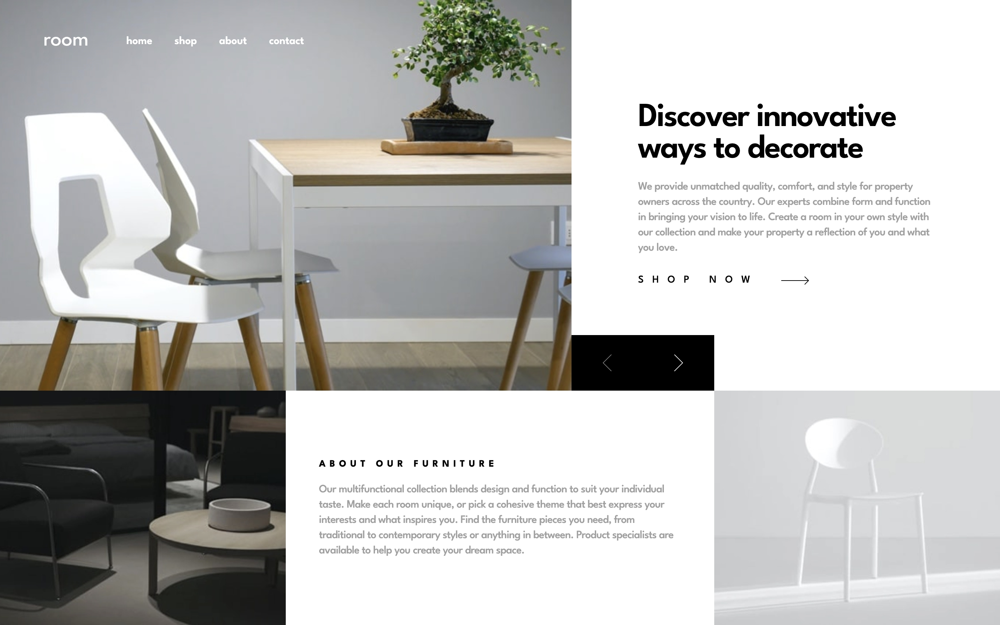
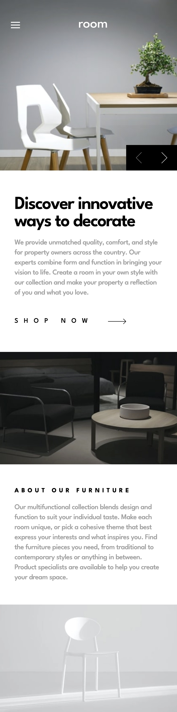

# Frontend Mentor - Room homepage solution

This is a solution to the [Room homepage challenge on Frontend Mentor](https://www.frontendmentor.io/challenges/room-homepage-BtdBY_ENq). Frontend Mentor challenges help you improve your coding skills by building realistic projects.

## Table of contents

- [Frontend Mentor - Room homepage solution](#frontend-mentor---room-homepage-solution)
  - [Table of contents](#table-of-contents)
  - [Overview](#overview)
    - [The challenge](#the-challenge)
    - [Screenshot](#screenshot)
    - [Links](#links)
  - [My process](#my-process)
    - [Built with](#built-with)
    - [What I learned](#what-i-learned)
    - [Continued development](#continued-development)

## Overview

### The challenge

Users should be able to:

- View the optimal layout for the site depending on their device's screen size
- See hover states for all interactive elements on the page
- Navigate the slider using either their mouse/trackpad or keyboard

### Screenshot

Desktop

Mobile

### Links

- [Live Site URL](https://room-homepage.frilly.dev/)

## My process

### Built with

- [Astro](https://astro.build/)
- [Tailwind CSS](https://tailwindcss.com/)
- [SolidJS](https://www.solidjs.com/)
- [Nanostores](https://github.com/nanostores/)

### What I learned

I learned that grid elements overlap each other willingly, as long as you specify the area it's supposed to take. I think this works really well for the design layout provided. For example, the arrow buttons should line up with the text box below, and using flexbox wouldn't be possible? I think it is possible with a lot of calculations and moving via translations, but it's definitely much messier than applying a grid layout.

### Continued development

I had some trouble with the styling of the CSS grid, and I should have finished this faster as the only difficult thing was realizing it should be one whole grid, instead of 2 flexboxes on each row.
